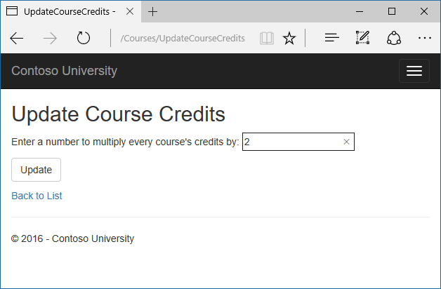
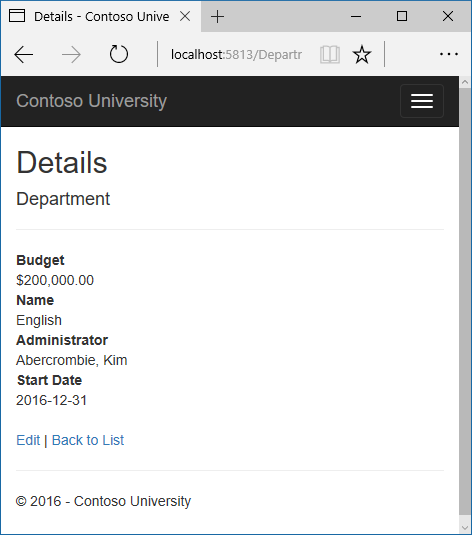
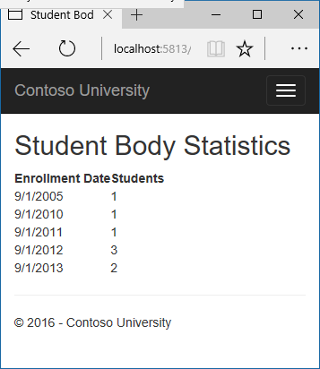
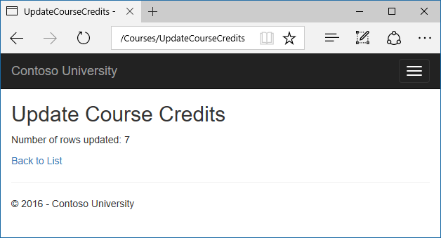
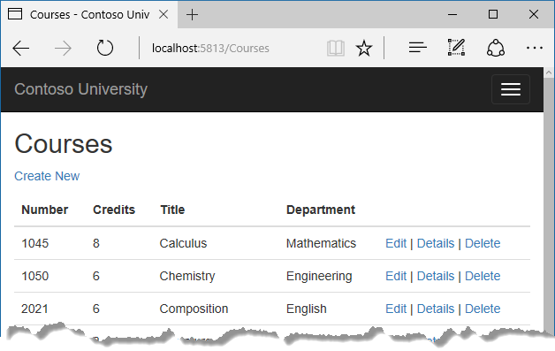

Advanced topics
===============

The Contoso University sample web application demonstrates how to create ASP.NET Core 1.0 MVC web applications using Entity Framework Core 1.0 and Visual Studio 2015. For information about the tutorial series, see :doc:`the first tutorial in the series </data/ef-mvc/intro>`.

In the previous tutorial you implemented table-per-hierarchy inheritance. This tutorial introduces several topics that are useful to be aware of when you go beyond the basics of developing ASP.NET web applications that use Entity Framework Code First. Step-by-step instructions walk you through the code and using Visual Studio for the following topics:

* Performing raw SQL queries
* Examining SQL sent to the database

For several topics, the tutorial offers brief introductions followed by links to resources for more information:

* Performing no-tracking queries
* Repository and unit of work patterns
* Proxy classes
* Automatic change detection
* Automatic validation
* Entity Framework source code
* Reverse engineer from existing database
* Database Providers
* Visualization tools

The tutorial also includes the following sections:

* Summary
* Acknowledgments
* A note about VB
* Common errors, and solutions or workarounds for them

For most of these topics, you'll work with pages that you already created. To use raw SQL to do bulk updates you'll create a new page that updates the number of credits of all courses in the database:

Performing Raw SQL Queries
--------------------------

One of the advantages of using the Entity Framework is that it avoids tying your code too closely to a particular method of storing data. It does this by generating SQL queries and commands for you, which also frees you from having to write them yourself. But there are exceptional scenarios when you need to run specific SQL queries that you have manually created. For these scenarios, the Entity Framework Code First API includes methods that enable you to pass SQL commands directly to the database. You have the following options in EF Core 1.0:

* Use the DbSet.FromSql method for queries that return entity types. The returned objects must be of the type expected by the DbSet object, and they are automatically tracked by the database context unless you `turn tracking off <#notracking>`__.

* Use the Database.ExecuteSqlCommand for non-query commands.

If you need to run a query that returns types that aren't entities, you can use ADO.NET with the database connection provided by EF. The returned data isn't tracked by the database context, even if you use this method to retrieve entity types.

As is always true when you execute SQL commands in a web application, you must take precautions to protect your site against SQL injection attacks. One way to do that is to use parameterized queries to make sure that strings submitted by a web page can't be interpreted as SQL commands. In this tutorial you'll use parameterized queries when integrating user input into a query.

Call a Query that returns entities
----------------------------------

The `DbSet<TEntity>` class provides a method that you can use to execute a query that returns an entity of type TEntity. To see how this works you'll change the code in the Details method of the Department controller.

In DepartmentController.cs, in the Details method, replace the db.Departments.FindAsync method call with a db.Departments.SqlQuery method call, as shown in the following highlighted code:

.. literalinclude::  intro/samples/cu/Controllers/DepartmentsController.cs
  :language: c#
  :start-after: snippet_RawSQL
  :end-before:  #endregion
  :linenos:
  :dedent: 8

To verify that the new code works correctly, select the Departments tab and then Details for one of the departments.

Call a query that returns other types
----------------------------------------

Earlier you created a student statistics grid for the About page that showed the number of students for each enrollment date. The code that does this in HomeController.cs uses the Students DbSet property:

.. literalinclude::  intro/samples/cu/Controllers/HomeController.cs
  :language: c#
  :start-after: snippet_UseDbSet
  :end-before:  #endregion
  :linenos:
  :dedent: 8

Suppose you want to write the code that retrieves this data directly in SQL rather than using LINQ. To do that you need to run a query that returns something other than entity objects, which means you need to use ADO.NET.

In HomeController.cs, replace the LINQ statement in the About method with a SQL statement, as shown in the following highlighted code:

.. literalinclude::  intro/samples/cu/Controllers/HomeController.cs
  :language: c#
  :start-after: snippet_UseRawSQL
  :end-before:  #endregion
  :linenos:
  :dedent: 8

Add using statements:

.. literalinclude::  intro/samples/cu/Controllers/HomeController.cs
  :language: c#
  :start-after: snippet_Usings2
  :end-before:  #endregion

Run the About page. It displays the same data it did before.

Call an update query
--------------------

Suppose Contoso University administrators want to perform global changes in the database, such as changing the number of credits for every course. If the university has a large number of courses, it would be inefficient to retrieve them all as entities and change them individually. In this section you'll implement a web page that enables the user to specify a factor by which to change the number of credits for all courses, and you'll make the change by executing a SQL UPDATE statement. The web page will look like the following illustration:

In *CoursesContoller.cs*, add UpdateCourseCredits methods for HttpGet and HttpPost:

.. literalinclude::  intro/samples/cu/Controllers/CoursesController.cs
  :language: c#
  :start-after: snippet_UpdateGet
  :end-before:  #endregion

.. literalinclude::  intro/samples/cu/Controllers/CoursesController.cs
  :language: c#
  :start-after: snippet_UpdatePost
  :end-before:  #endregion

When the controller processes an HttpGet request, nothing is returned in ViewData["RowsAffected"], and the view displays an empty text box and a submit button, as shown in the preceding illustration.

When the Update button is clicked, the HttpPost method is called, and multiplier has the value entered in the text box. The code then executes the SQL that updates courses and returns the number of affected rows to the view in the ViewBag.RowsAffected variable. When the view gets a value in that variable, it displays the number of rows updated.

In Solution Explorer, right-click the *Views/Courses* folder, and then click Add > New Item.

In the Add New Item dialog, click ASP.NET under Installed in the left pane, click MVC View Page, and name the new view *UpdateCourseCredits.cshtml*.

In *Views/Courses/UpdateCourseCredits.cshtml*, replace the template code with the following code:

.. literalinclude::  intro/samples/cu/Views/Courses/UpdateCourseCredits.cshtml
  :language: html

Run the UpdateCourseCredits method by selecting the Courses tab, then adding "/UpdateCourseCredits" to the end of the URL in the browser's address bar (for example: `http://localhost:50205/Course/UpdateCourseCredits)`. Enter a number in the text box:

Click **Update**. You see the number of rows affected:

Click Back to List to see the list of courses with the revised number of credits.

For more information about raw SQL queries, see `Raw SQL Queries <https://ef.readthedocs.io/en/latest/querying/raw-sql.html>`__.

Examining SQL sent to the database
----------------------------------

Sometimes it's helpful to be able to see the actual SQL queries that are sent to the database. Built-in logging functionality for ASP.NET Core is automatically used by EF Core to write logs that contain the SQL for queries and updates. In this section you'll see some examples of SQL logging.

Open StudentsController.cs and set a breakpoint on the ``if (student == null)`` statement.

Run the application in debug mode, and go to the Details page for a student.

Go to the Output window showing debug output, and you see the query:

.. code-block:: text

  Microsoft.EntityFrameworkCore.Storage.Internal.RelationalCommandBuilderFactory:Information: Executed DbCommand (0ms) [Parameters=[@__id_0='?'], CommandType='Text', CommandTimeout='30']
  SELECT TOP(2) [s].[ID], [s].[EnrollmentDate], [s].[FirstName], [s].[LastName]
  FROM [Student] AS [s]
  WHERE [s].[ID] = @__id_0
  ORDER BY [s].[ID]
  Microsoft.EntityFrameworkCore.Storage.Internal.RelationalCommandBuilderFactory:Information: Executed DbCommand (9ms) [Parameters=[@__id_0='?'], CommandType='Text', CommandTimeout='30']
  SELECT [e].[EnrollmentID], [e].[CourseID], [e].[Grade], [e].[StudentID], [c].[CourseID], [c].[Credits], [c].[DepartmentID], [c].[Title]
  FROM [Enrollment] AS [e]
  INNER JOIN [Course] AS [c] ON [e].[CourseID] = [c].[CourseID]
  WHERE EXISTS (
      SELECT TOP(2) 1
      FROM [Student] AS [s]
      WHERE ([s].[ID] = @__id_0) AND ([e].[StudentID] = [s].[ID]))
  ORDER BY [e].[StudentID]

You'll notice something here that might surprise you: the SQL selects up to 2 rows (``TOP(2)``). The SingleOrDefaultAsync method doesn't resolve to one row on the server. But if the Where clause matches multiple rows the method must return null. So EF selects up to 2, because if 3 or more match the Where clause, the result from the SingleOrDefault method is the same.

Note that you don't have to use debug mode and stop at a breakpoint to get logging output in the Output window. It's just a convenient way to stop the logging at the point you want to look at the output. Otherwise logging continues and you have to scroll back to find the parts you're interested in.

No-tracking queries
-------------------

When a database context retrieves table rows and creates entity objects that represent them, by default it keeps track of whether the entities in memory are in sync with what's in the database. The data in memory acts as a cache and is used when you update an entity. This caching is often unnecessary in a web application because context instances are typically short-lived (a new one is created and disposed for each request) and the context that reads an entity is typically disposed before that entity is used again.

You can disable tracking of entity objects in memory by using the AsNoTracking method. Typical scenarios in which you might want to do that include the following:

* A query retrieves such a large volume of data that turning off tracking might noticeably enhance performance.
* You want to attach an entity in order to update it, but you earlier retrieved the same entity for a different purpose. Because the entity is already being tracked by the database context, you can't attach the entity that you want to change. One way to handle this situation is to use the AsNoTracking option with the earlier query.

Repository and unit of work patterns
------------------------------------

Many developers write code to implement the repository and unit of work patterns as a wrapper around code that works with the Entity Framework. These patterns are intended to create an abstraction layer between the data access layer and the business logic layer of an application. Implementing these patterns can help insulate your application from changes in the data store and can facilitate automated unit testing or test-driven development (TDD). However, writing additional code to implement these patterns is not always the best choice for applications that use EF, for several reasons:

* The EF context class itself insulates your code from data-store-specific code.
* The EF context class can act as a unit-of-work class for database updates that you do using EF.
* EF includes features for implementing TDD without writing repository code.

For more information about how to implement the repository and unit of work patterns, see `the Entity Framework 5 version of this tutorial series <http://www.asp.net/mvc/overview/older-versions/getting-started-with-ef-5-using-mvc-4/implementing-the-repository-and-unit-of-work-patterns-in-an-asp-net-mvc-application>`__. 

Entity Framework Core implements an in-memory database provider that can be used for testing. For more information, see `Testing with InMemory <https://ef.readthedocs.io/en/latest/miscellaneous/testing.html>`__.

Automatic change detection
--------------------------

The Entity Framework determines how an entity has changed (and therefore which updates need to be sent to the database) by comparing the current values of an entity with the original values. The original values are stored when the entity is queried or attached. Some of the methods that cause automatic change detection are the following:

* DbSet.Find
* DbSet.Local
* DbSet.Remove
* DbSet.Add
* DbSet.Attach
* DbContext.SaveChanges
* DbContext.GetValidationErrors
* DbContext.Entry

If you're tracking a large number of entities and you call one of these methods many times in a loop, you might get significant performance improvements by temporarily turning off automatic change detection using the AutoDetectChangesEnabled property.

Automatic validation

When you call the SaveChanges method, by default the Entity Framework validates the data in all properties of all changed entities before updating the database. If you've updated a large number of entities and you've already validated the data, this work is unnecessary and you could make the process of saving the changes take less time by temporarily turning off validation. You can do that using the ValidateOnSaveEnabled property.

Entity Framework Core source code
---------------------------------

The source code for Entity Framework Core is available at https://github.com/aspnet/EntityFramework. Besides source code, you can get nightly builds, issue tracking, feature specs, design meeting notes, and more. You can file bugs, and you can contribute your own enhancements to the EF source code.

Although the source code is open, Entity Framework Core is fully supported as a Microsoft product. The Microsoft Entity Framework team keeps control over which contributions are accepted and tests all code changes to ensure the quality of each release. 

Reverse engineer from existing database
---------------------------------------

To reverse engineer a data model including entity classes from an existing database, use the `scaffold-dbcontext <https://ef.readthedocs.io/en/latest/miscellaneous/cli/powershell.html#scaffold-dbcontext>`__ command.

Summary
-------

This completes this series of tutorials on using the Entity Framework Core in an ASP.NET MVC application. For more information about how to work with data using the Entity Framework, see the `EF documentation <https://ef.readthedocs.io/>`__.

For information about how to deploy your web application after you've built it, see `Publishing and deployment <https://docs.asp.net/en/latest/publishing/index.html>`__.

For information about other topics related to ASP.NET Core MVC, such as authentication and authorization, see the `ASP.NET Core documentation <https://docs.asp.net/>`__.

Acknowledgments
---------------

Tom Dykstra and Rick Anderson (twitter @RickAndMSFT) wrote this tutorial.
Rowan Miller, Diego Vega, and other members of the Entity Framework team assisted with code reviews and helped debug issues that arose while we were writing code for the tutorials.

Common errors, and solutions or workarounds for them
------------------------------------------------------

EF command not recognized in PMC
^^^^^^^^^^^^^^^^^^^^^^^^^^^^^^^^

Error message:

The term 'use-dbcontext' is not recognized as the name of a cmdlet, function, script file, or operable program. Check the spelling of the name, or if a path was included, verify that the path is correct and try again.

Solution:

Close the project, close Visual Studio, and reopen Visual Studio.

Error locating SQL Server instance
^^^^^^^^^^^^^^^^^^^^^^^^^^^^^^^^^^

Error Message:

A network-related or instance-specific error occurred while establishing a connection to SQL Server. The server was not found or was not accessible. Verify that the instance name is correct and that SQL Server is configured to allow remote connections. (provider: SQL Network Interfaces, error: 26 - Error Locating Server/Instance Specified)

Solution:

Check the connection string. If you have manually deleted the database, change the name of the database in the construction string.

SQL open error
^^^^^^^^^^^^^^

You must stop IIS Express before you update the database. If IIS-Express is running, you’ll get error CS2012: Cannot open ‘MvcMovie/bin/Debug/netcoreapp1.0/MvcMovie.dll’ for writing – ‘The process cannot access the file ‘MvcMovie/bin/Debug/netcoreapp1.0/MvcMovie.dll’ because it is being used by another process.’