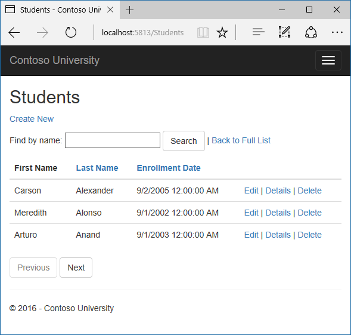

Migrations
==========

The Contoso University sample web application demonstrates how to create ASP.NET Core 1.0 MVC web applications using Entity Framework Core 1.0 and Visual Studio 2015. For information about the tutorial series, see :doc:`the first tutorial in the series </data/ef-mvc/intro>`.

When you develop a new application, your data model changes frequently, and each time the model changes, it gets out of sync with the database. You started by configuring the Entity Framework to automatically create the database if it doesn't exist. Then each time you change the data model -- add, remove, or change entity classes or change your DbContext class -- you can delete the database and EF creates a new one that matches the model, and seeds it with test data.

This method of keeping the database in sync with the data model works well until you deploy the application to production. When the application is running in production it is usually storing data that you want to keep, and you don't want to lose everything each time you make a change such as adding a new column. The EF Core Migrations feature solves this problem by enabling EF to update the database schema instead of creating  a new database. 

In this tutorial, you create your first migration. In later tutorials, you'll add more migrations as you change the data model.

Create an initial migration
---------------------------

In the *appsettings.json* file, change the name of the database in the connection string to ContosoUniversity2.

.. literalinclude::  intro/samples/cu/appsettings.json
  :language: json
  :end-before:  Logging
  :emphasize-lines: 6

This change sets up the project so that the first migration will create a new database. This isn't required but you'll see later why it's a good idea.

From the Tools menu, click **Library Package Manager** and then **Package Manager Console**.

.. image:: migrations/_static/pmc.png
   :alt: PMC in menu

At the **PM>** prompt enter the following commands:

.. code-block:: text

  use-dbcontext SchoolContext
  add-migration InitialCreate

.. image:: migrations/_static/pmc-add-migration.png
   :alt: PMC command execution

The ``use-dbcontext`` statement is required because the project has two database context classes (the other one is for ASP.NET Identity).  As an alternative, you can specify with each command the context class to use by adding the ``-context <contextclassname>`` switch.

When you executed the ``add-migration`` command, Migrations generated the code that would create the database from scratch. This code is in the Migrations folder, in the file named `<timestamp>_InitialCreate.cs`. The ``Up`` method of the ``InitialCreate`` class creates the database tables that correspond to the data model entity sets, and the ``Down`` method deletes them. 

.. literalinclude::  intro/samples/cu/Migrations/20160726224716_InitialCreate.cs
  :start-after: snippet_Truncate
  :end-before:  #endregion
  :language: c#
  :dedent: 4

Migrations calls the Up method to implement the data model changes for a migration. When you enter a command to roll back the update, Migrations calls the Down method.

This is the initial migration that was created when you entered the ``add-migration InitialCreate`` command. The parameter ("InitialCreate" in the example) is used for the file name and can be whatever you want; you typically choose a word or phrase that summarizes what is being done in the migration. For example, you might name a later migration "AddDepartmentTable".

If you created the initial migration when the database already exists, the database creation code is generated but it doesn't have to run because the database already matches the data model. When you deploy the app to another environment where the database doesn't exist yet, this code will run to create your database, so it's a good idea to test it first. That's why you changed the name of the database in the connection string earlier -- so that migrations can create a new one from scratch.

In the **Package Manager Console** window, enter the following command:

.. code-block:: c#

  update-database

.. image:: migrations/_static/pmc-update-database.png
   :alt: PMC command execution

The ``update-database`` command runs the Up method to create the database. The same process will run automatically in production after you deploy the application, as you'll see in the following section.

Use **SQL Server Object Explorer** to inspect the database as you did in the first tutorial.  You'll notice the addition of an __EFMigrationsHistory table that keeps track of which migrations have been applied to the database.

.. image:: migrations/_static/ssox.png
   :alt: Migrations history in SSOX

Migrations also creates a "snapshot" of the current database schema in *Migrations/SchoolContextModelSnapshot.cs*. For this reason,  if you decide you don't want a migration after you create it, don't delete the `<timestamp>_<migrationname>.cs` file. If you did that, the remaining migrations would be out of sync with the database snapshot file. To delete the last migration that you added, use the `remove-migration <https://docs.efproject.net/en/latest/miscellaneous/cli/powershell.html#remove-migration>`__ command.

Run the application to verify that everything still works the same as before.

 
Command line interface (CLI) vs. Package Manager Console (PMC)
--------------------------------------------------------------

Because this tutorial is about using Visual Studio to develop apps that use EF Core, it shows how to use the **Package Manager Console**. You can also run the same commands from the cross-platform command-line interface. For more information, see `.NET Core CLI <https://ef.readthedocs.io/en/latest/miscellaneous/cli/dotnet.html>`__.
		
Summary
-------

In this tutorial you've seen how to create and apply your first migration. In the next tutorial you'll begin looking at more advanced topics by expanding the data model. Along the way you'll create and apply additional migrations.
