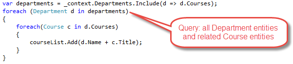

Reading related data
====================

The Contoso University sample web application demonstrates how to create ASP.NET Core 1.0 MVC web applications using Entity Framework Core 1.0 and Visual Studio 2015. For information about the tutorial series, see :doc:`the first tutorial in the series </data/ef-mvc/intro>`.

In the previous tutorial you completed the School data model. In this tutorial you'll read and display related data — that is, data that the Entity Framework loads into navigation properties.

The following illustrations show the pages that you'll work with.

.. image:: read-related-data/_static/courses-index.png
   :alt: Courses Index page

Lazy, Eager, and Explicit Loading of Related Data
-------------------------------------------------

There are several ways that Object-Relational Mapping (ORM) software such as Entity Framework can load related data into the navigation properties of an entity:

* Lazy loading. When the entity is first read, related data isn't retrieved. However, the first time you attempt to access a navigation property, the data required for that navigation property is automatically retrieved. This results in multiple queries sent to the database — one for the entity itself and one each time that related data for the entity must be retrieved. Entity Framework 6.x supports lazy loading, but Entity Framework 1.0 does not. 

.. image:: read-related-data/_static/lazy-loading.png
   :alt: Lazy loading example

* Eager loading. When the entity is read, related data is retrieved along with it. This typically results in a single join query that retrieves all of the data that's needed. You specify eager loading in Entity Framework Core by using the ``Include`` and ``ThenInclude`` methods.

* Explicit loading. This is similar to lazy loading, except that you explicitly retrieve the related data in code; it doesn't happen automatically when you access a navigation property. To load related data manually, you create an IQueryable object that gets the entities you want, and then you call the Load method. 

.. image:: read-related-data/_static/explicit-loading.png
   :alt: Explicit loading example

Because they don't immediately retrieve the property values, lazy loading and explicit loading are also both known as deferred loading.

Performance considerations
^^^^^^^^^^^^^^^^^^^^^^^^^^

If you know you need related data for every entity retrieved, eager loading often offers the best performance, because a single query sent to the database is typically more efficient than separate queries for each entity retrieved. For example, suppose that each department has ten related courses. Eager loading would result in just a single (join) query and a single round trip to the database. Explicit loading would result in eleven queries and eleven round trips to the database. The extra round trips to the database are especially detrimental to performance when latency is high.

On the other hand, in some scenarios explicit loading is more efficient. Eager loading might cause a very complex join to be generated, which SQL Server can't process efficiently. Or if you need to access an entity's navigation properties only for a subset of a set of the entities you're processing, explicit loading might perform better because eager loading would retrieve more data than you need. If performance is critical, it's best to test performance both ways in order to make the best choice.

Create a Courses page that displays Department name
---------------------------------------------------

The Course entity includes a navigation property that contains the Department entity of the department that the course is assigned to. To display the name of the assigned department in a list of courses, you need to get the Name property from the Department entity that is in the ``Course.Department`` navigation property.

Create a controller named CoursesController for the Course entity type, using the same options for the MVC Controller with views, using Entity Framework scaffolder that you did earlier for the Student controller, as shown in the following illustration:

Open *CourseController.cs* and examine the Index method. The automatic scaffolding has specified eager loading for the Department navigation property by using the Include method.

Replace the Index method with the following code that uses a more appropriate name for the IQueryable of Course entities (``courses`` instead of ``schoolContext``):

.. literalinclude::  intro/samples/cu/Controllers/CoursesController.cs
  :language: c#
  :start-after: snippet_RevisedIndexMethod
  :end-before:  #endregion
  :dedent: 8

Open *Views/Course/Index.cshtml* and replace the template code with the following code. The changes are highlighted:

.. literalinclude::  intro/samples/cu/Views/Courses/Index.cshtml
  :language: html
  :linenos:
  :emphasize-lines: 4,7,15-17,24-26,34-36,43-45

You've made the following changes to the scaffolded code:

* Changed the heading from Index to Courses.
* Added a Number column that shows the CourseID property value. By default, primary keys aren't scaffolded because normally they are meaningless to end users. However, in this case the primary key is meaningful and you want to show it.
* Added the Department column. Notice that for the Department column, the code displays the Name property of the Department entity that's loaded into the Department navigation property:

.. code-block:: html

  @Html.DisplayFor(modelItem => item.Department.Name)

Run the page (select the Courses tab on the Contoso University home page) to see the list with department names.

.. image:: read-related-data/_static/courses-index.png
   :alt: Courses Index page

Create an Instructors page that shows Courses and Enrollments
-------------------------------------------------------------

In this section you'll create a controller and view for the Instructor entity in order to display the Instructors page:

This page reads and displays related data in the following ways:

* The list of instructors displays related data from the OfficeAssignment entity. The Instructor and OfficeAssignment entities are in a one-to-zero-or-one relationship. You'll use eager loading for the OfficeAssignment entities. As explained earlier, eager loading is typically more efficient when you need the related data for all retrieved rows of the primary table. In this case, you want to display office assignments for all displayed instructors.

* When the user selects an instructor, related Course entities are displayed. The Instructor and Course entities are in a many-to-many relationship. You'll use eager loading for the Course entities and their related Department entities. In this case, explicit loading might be more efficient because you need courses only for the selected instructor. However, this example shows how to use eager loading for navigation properties within entities that are themselves in navigation properties.

* When the user selects a course, related data from the Enrollments entity set is displayed. The Course and Enrollment entities are in a one-to-many relationship. You'll add explicit loading for Enrollment entities and their related Student entities.

Create a view model for the Instructor Index view
^^^^^^^^^^^^^^^^^^^^^^^^^^^^^^^^^^^^^^^^^^^^^^^^^

The Instructors page shows data from three different tables. Therefore, you'll create a view model that includes three properties, each holding the data for one of the tables.

In the *SchoolViewModels* folder, create *InstructorIndexData.cs* and replace the existing code with the following code:

.. literalinclude::  intro/samples/cu/Models/SchoolViewModels/InstructorIndexData.cs
  :language: c#

Create the Instructor controller and views
^^^^^^^^^^^^^^^^^^^^^^^^^^^^^^^^^^^^^^^^^^

Create an Instructors controller with EF read/write actions as shown in the following illustration:

Open *InstructorsController.cs* and add a using statement for the ViewModels namespace:

.. literalinclude::  intro/samples/cu/Controllers/InstructorsController.cs
  :language: c#
  :start-after: snippet_Using
  :end-before:  #endregion

Replace the Index method with the following code to do eager loading of related data and put it in the view model.

.. literalinclude::  intro/samples/cu/Controllers/InstructorsController.cs
  :language: c#
  :start-after: snippet_EagerLoading
  :end-before:  #endregion
  :dedent: 8

The method accepts optional route data (id) and a query string parameter (courseID) that provide the ID values of the selected instructor and selected course. The parameters are provided by the **Select** hyperlinks on the page.

The code begins by creating an instance of the view model and putting in it the list of instructors. The code specifies eager loading for the ``Instructor.OfficeAssignment`` and the ``Instructor.Courses`` navigation property. Within the ``Courses`` property, the ``Enrollments`` and ``Department`` properties are loaded, and within each ``Enrollment`` entity the ``Student`` property is loaded. 

.. literalinclude::  intro/samples/cu/Controllers/InstructorsController.cs
  :language: c#
  :lines: 41-50
  :dedent: 12

Since the view always requires the OfficeAssignment entity, it's more efficient to fetch that in the same query. Course entities are required when an instructor is selected in the web page, so eager loading is better than explicit loading only if the page is displayed more often with a course selected than without.

If an instructor ID was selected, the selected instructor is retrieved from the list of instructors in the view model. The view model's Courses property is then loaded with the Course entities from that instructor's Courses navigation property.

.. literalinclude::  intro/samples/cu/Controllers/InstructorsController.cs
  :language: c#
  :lines: 52-58
  :dedent: 12

The Where method returns a collection, but in this case the criteria passed to that method result in only a single Instructor entity being returned. The Single method converts the collection into a single Instructor entity, which gives you access to that entity's Courses property. The Courses property contains CourseInstructor entities, from which you want only the related Course entities.

You use the Single method on a collection when you know the collection will have only one item. The Single method throws an exception if the collection passed to it is empty or if there's more than one item. An alternative is SingleOrDefault, which returns a default value (null in this case) if the collection is empty. However, in this case that would still result in an exception (from trying to find a Courses property on a null reference), and the exception message would less clearly indicate the cause of the problem. When you call the Single method, you can also pass in the Where condition instead of calling the Where method separately:

.. code-block:: c#

  .Single(i => i.ID == id.Value)

Instead of:

.. code-block:: c#

  .Where(I => i.ID == id.Value).Single()

Next, if a course was selected, the selected course is retrieved from the list of courses in the view model. Then the view model's Enrollments property is loaded with the Enrollment entities from that course's Enrollments navigation property.

.. literalinclude::  intro/samples/cu/Controllers/InstructorsController.cs
  :language: c#
  :lines: 60-65
  :dedent: 12

Modify the Instructor Index view
^^^^^^^^^^^^^^^^^^^^^^^^^^^^^^^^

In *Views/Instructor/Index.cshtml*, replace the template code with the following code. 

.. literalinclude::  intro/samples/cu/Views/Instructors/Index1.cshtml
  :language: html
  :start-after: snippet_Instructors
  :end-before: snippet_Instructors
  :emphasize-lines: 1,3-7,18,41-46,56

You've made the following changes to the existing code:

* Changed the model class to InstructorIndexData.
* Changed the page title from Index to Instructors.
* Added an Office column that displays item.OfficeAssignment.Location only if item.OfficeAssignment is not null. (Because this is a one-to-zero-or-one relationship, there might not be a related OfficeAssignment entity.)

.. literalinclude::  intro/samples/cu/Views/Instructors/Index1.cshtml
  :language: html
  :lines: 42-46
  :dedent: 20

* Added code that will dynamically add class="success" to the tr element of the selected instructor. This sets a background color for the selected row using a Bootstrap class.

.. literalinclude::  intro/samples/cu/Views/Instructors/Index1.cshtml
  :language: html
  :lines: 26-31
  :dedent: 12

* Added a new ActionLink labeled **Select** immediately before the other links in each row, which causes the selected instructor ID to be sent to the Index method.

.. literalinclude::  intro/samples/cu/Views/Instructors/Index1.cshtml
  :language: html
  :lines: 57
  :dedent: 20

* Reordered the columns to display Last Name, First Name, Hire Date, and Office in that order.

Run the application and select the Instructors tab. The page displays the Location property of related OfficeAssignment entities and an empty table cell when there's no related OfficeAssignment entity.

In the *Views/Instructor/Index.cshtml* file, after the closing table element (at the end of the file), add the following code. This code displays a list of courses related to an instructor when an instructor is selected.

.. literalinclude::  intro/samples/cu/Views/Instructors/Index1.cshtml
  :language: html
  :start-after: snippet_Courses
  :end-before: snippet_Courses

This code reads the Courses property of the view model to display a list of courses. It also provides a Select hyperlink that sends the ID of the selected course to the Index action method.

Run the page and select an instructor. Now you see a grid that displays courses assigned to the selected instructor, and for each course you see the name of the assigned department.

After the code block you just added, add the following code. This displays a list of the students who are enrolled in a course when that course is selected.

.. literalinclude::  intro/samples/cu/Views/Instructors/Index1.cshtml
  :language: html
  :start-after: snippet_Enrollments
  :end-before: snippet_Enrollments

This code reads the Enrollments property of the view model in order to display a list of students enrolled in the course.

Run the page and select an instructor. Then select a course to see the list of enrolled students and their grades.

Add explicit loading
--------------------

When you retrieved the list of instructors in *InstructorsController.cs*, you specified eager loading for the Courses navigation property. 

Suppose you expected users to only rarely want to see enrollments in a selected instructor and course. In that case, you might want to to load the enrollment data only if it's requested. To do that you (a) omit eager loading for enrollments when reading instructors, and (b) only when enrollments are needed, call the Load method on an IQueryable that reads the ones you need (in EF Core 1.0.0, LoadAsync is not recommended).  EF automatically "fixes up" the Courses navigation property of already-retrieved Instructor entities with data retrieved by the Load method.

To see this in action, replace the Index method with the following code:

.. literalinclude::  intro/samples/cu/Controllers/InstructorsController.cs
  :language: c#
  :start-after: snippet_ExplicitLoading
  :end-before:  #endregion
  :dedent: 8

The new code drops the `.ThenInclude(i => i.Enrollments).ThenInclude(i => i.Student)` statements from the code that retrieves instructor entities. Then if an instructor and course are selected, it retrieves Enrollment entities for that courrse.  With these Enrollment entities, the code eagerly loads the Student navigation property.  

.. literalinclude::  intro/samples/cu/Controllers/InstructorsController.cs
  :language: c#
  :linenos:
  :lines: 92-102
  :emphasize-lines: 4-6
  :dedent: 12

So now, only enrollments taught by the selected instructor in the selected course are retrieved from the database.

Run the Instructor Index page now and you'll see no difference in what's displayed on the page, although you've changed how the data is retrieved.

Summary
-------

You've now used both eager and explicit loading to read related data into navigation properties. In the next tutorial you'll learn how to update related data.
