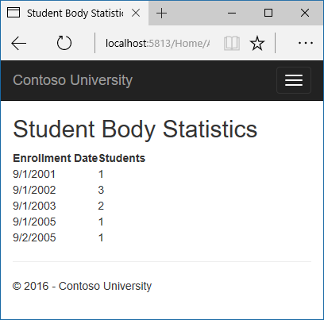

Sorting, filtering, paging, and grouping
========================================

By `Tom Dykstra`_

The Contoso University sample web application demonstrates how to create ASP.NET Core 1.0 MVC web applications using Entity Framework Core 1.0 and Visual Studio 2015. For information about the tutorial series, see :doc:`the first tutorial in the series </data/ef-mvc/intro>`.

In the previous tutorial you implemented a set of web pages for basic CRUD operations for Student entities. In this tutorial you'll add sorting, filtering, and paging functionality to the Students Index page. You'll also create a page that does simple grouping.

The following illustration shows what the page will look like when you're done. The column headings are links that the user can click to sort by that column. Clicking a column heading repeatedly toggles between ascending and descending sort order.

.. image:: sort-filter-page/_static/paging.png
   :alt: Students index page

Add Column Sort Links to the Students Index Page
------------------------------------------------

To add sorting to the Student Index page, you'll change the Index method of the Student controller and add code to the Student Index view.

Add Sorting Functionality to the Index Method
^^^^^^^^^^^^^^^^^^^^^^^^^^^^^^^^^^^^^^^^^^^^^

In *StudentController.cs*, replace the Index method with the following code:

.. literalinclude::  intro/samples/cu/Controllers/StudentsController.cs
  :language: c#
  :linenos:
  :start-after: snippet_SortOnly
  :end-before:  #endregion
  :dedent: 8

This code receives a sortOrder parameter from the query string in the URL. The query string value is provided by ASP.NET Core MVC as a parameter to the action method. The parameter will be a string that's either "Name" or "Date", optionally followed by an underscore and the string "desc" to specify descending order. The default sort order is ascending.

The first time the Index page is requested, there's no query string. The students are displayed in ascending order by LastName, which is the default as established by the fall-through case in the switch statement. When the user clicks a column heading hyperlink, the appropriate sortOrder value is provided in the query string.

The two ViewData elements (NameSortParm and DateSortParm) are used so that the view can configure the column heading hyperlinks with the appropriate query string values.

.. code-block:: c#

  ViewData["NameSortParm"] = String.IsNullOrEmpty(sortOrder) ? "name_desc" : "";
  ViewData["DateSortParm"] = sortOrder == "Date" ? "date_desc" : "Date";

These are ternary statements. The first one specifies that if the sortOrder parameter is null or empty, NameSortParm should be set to "name_desc"; otherwise, it should be set to an empty string. These two statements enable the view to set the column heading hyperlinks as follows:

====================  =====================  ================
 Current sort order    Last Name Hyperlink    Date Hyperlink
====================  =====================  ================
Last Name ascending   descending             ascending
Last Name descending  ascending              ascending
Date ascending        ascending              descending
Date descending       ascending              ascending
====================  =====================  ================

The method uses LINQ to Entities to specify the column to sort by. The code creates an IQueryable variable before the switch statement, modifies it in the switch statement, and calls the ToListAsync method after the switch statement. When you create and modify IQueryable variables, no query is sent to the database. The query is not executed until you convert the IQueryable object into a collection by calling a method such as ToListAsync. Therefore, this code results in a single query that is not executed until the ``return View`` statement.

Add Column Heading Hyperlinks to the Student Index View
^^^^^^^^^^^^^^^^^^^^^^^^^^^^^^^^^^^^^^^^^^^^^^^^^^^^^^^

Replace the code in *Views/Student/Index.cshtml*, with the following code to rearrange the column order and add column heading hyperlinks. The new column headings are highlighted.

.. literalinclude::  intro/samples/cu/Views/Students/Index2.cshtml
  :language: c#
  :linenos:
  :emphasize-lines: 16,22
  :dedent: 8

This code uses the information in ViewData properties to set up hyperlinks with the appropriate query string values.

Run the page and click the **Last Name** and **Enrollment Date** column headings to verify that sorting works.

.. image:: sort-filter-page/_static/name-order.png
   :alt: Students index page in name order

Add a Search Box to the Students Index page
-------------------------------------------

To add filtering to the Students Index page, you'll add a text box and a submit button to the view and make corresponding changes in the Index method. The text box will let you enter a string to search for in the first name and last name fields.

Add filtering functionality to the Index method
^^^^^^^^^^^^^^^^^^^^^^^^^^^^^^^^^^^^^^^^^^^^^^^

In *StudentController.cs*, replace the Index method with the following code (the changes are highlighted).

.. literalinclude::  intro/samples/cu/Controllers/StudentsController.cs
  :language: c#
  :linenos:
  :start-after: snippet_SortFilter
  :end-before:  #endregion
  :emphasize-lines: 1,7-11
  :dedent: 8

You've added a ``searchString`` parameter to the Index method. The search string value is received from a text box that you'll add to the Index view. You've also added to the LINQ statement a where clause that selects only students whose first name or last name contains the search string. The statement that adds the where clause is executed only if there's a value to search for.

.. note:: Here you are calling the ``Where`` method on an ``IQueryable`` object, and the filter will be processed on the server. In some scenarios you might be calling the ``Where`` method as an extension method on an in-memory collection. (For example, suppose you change  ``_context.Students`` so that instead of an EF ``DbSet`` it references a repository that returns an ``IEnumerable`` collection.) The result would normally be the same but in some cases may be different.

  An example is variations in whether comparisons are case-insensitive. The .NET Framework implementation of the Contains method performs a case-sensitive comparison by default. But in SQL Server this is determined by the collation setting of the SQL Server instance, which defaults to case-insensitive. You could call the ToUpper method to make the test explicitly case-insensitive to ensure that results stay the same if you change the code later to use a repository which returns an IEnumerable collection instead of an IQueryable object. (When you call the Contains method on an IEnumerable collection, you get the .NET Framework implementation; when you call it on an IQueryable object, you get the database provider implementation.) However, there is a performance penalty for this solution. The code `Where(s => s.LastName.ToUpper().Contains(searchString.ToUpper())` would put a function in the WHERE clause of the TSQL SELECT statement. That would prevent the optimiser from using an index. Given that SQL is mostly installed as Case Insensitive, it's best to avoid the ToUpper code until you migrate to a case sensitive repository.

  Null handling may also be different for different database providers or when you use an IQueryable object compared to when you use an IEnumerable collection. For example, in some scenarios a Where condition such as table.Column != 0 may not return columns that have null as the value. For more information, see `Incorrect handling of null variables in 'where' clause <http://data.uservoice.com/forums/72025-entity-framework-feature-suggestions/suggestions/1015361-incorrect-handling-of-null-variables-in-where-cl>`.

Add a Search Box to the Student Index View
^^^^^^^^^^^^^^^^^^^^^^^^^^^^^^^^^^^^^^^^^^

In *Views/Student/Index.cshtml*, add the highlighted code immediately before the opening table tag in order to create a caption, a text box, and a Search button.

.. literalinclude::  intro/samples/cu/Views/Students/Index3.cshtml
  :language: html
  :start-after: snippet_Form
  :end-before:  snippet_Form
  :emphasize-lines: 5-13

This code uses the ``<form>`` `tag helper <https://docs.asp.net/en/latest/mvc/views/tag-helpers/intro.html>`__ to add the search text box and button. By default, the ``<form>`` tag helper submits form data with a POST, which means that parameters are passed in the HTTP message body and not in the URL as query strings. When you specify HTTP GET, the form data is passed in the URL as query strings, which enables users to bookmark the URL. The W3C guidelines recommend that you should use GET when the action does not result in an update.

Run the page, enter a search string, and click Search to verify that filtering is working.

.. image:: sort-filter-page/_static/filtering.png
   :alt: Students index page with filtering

Notice the URL contains the "an" search string, which means that if you bookmark this page, you'll get the filtered list when you use the bookmark. Adding `method="get"` to the form tag is what caused the query strings to be generated.

Add paging functionality to the Students Index page
---------------------------------------------------

To add paging to the Students Index page, you'll create a PaginatedList class that uses Skip and Take statements to filter data on the server instead of always retrieving all rows of the table. Then you'll make additional changes in the Index method and add paging links to the Index view. The following illustration shows the paging links.

.. image:: sort-filter-page/_static/paging.png
   :alt: Students index page with paging links

In the project folder create PaginatedList.cs, and then replace the template code with the following code.

.. literalinclude::  intro/samples/cu/PaginatedList.cs
  :language: c#

The ``CreateAsync`` method in this code takes page size and page number and applies the appropriate Skip and Take statements to the IQueryable. When ToListAsync is called on the IQueryable it will then return a List containing only the requested page. The properties HasPreviousPage and HasNextPage can be used to enable or disable Previous or Next paging buttons.

A ``CreateAsync`` method is used instead of a constructor to create the ``PaginatedList<T>`` object because constructors can't run asynchronous code.

Add paging functionality to the Index method
--------------------------------------------

In *StudentController.cs*, replace the Index method with the following code.

.. literalinclude::  intro/samples/cu/Controllers/StudentsController.cs
  :language: c#
  :start-after: snippet_SortFilterPage
  :end-before:  #endregion
  :emphasize-lines: 8
  :dedent: 2-6,8,12-19,21,46-47

This code adds a page number parameter, a current sort order parameter, and a current filter parameter to the method signature.

.. code-block:: c#

  public async Task<IActionResult> Index(
      string sortOrder,
      string currentFilter,
      string searchString,
      int? page)  

The first time the page is displayed, or if the user hasn't clicked a paging or sorting link, all the parameters will be null.  If a paging link is clicked, the page variable will contain the page number to display.

The ViewData element named CurrentSort provides the view with the current sort order, because this must be included in the paging links in order to keep the sort order the same while paging:

The ViewData element named CurrentFilter provides the view with the current filter string. This value must be included in the paging links in order to maintain the filter settings during paging, and it must be restored to the text box when the page is redisplayed. 

If the search string is changed during paging, the page has to be reset to 1, because the new filter can result in different data to display. The search string is changed when a value is entered in the text box and the submit button is pressed. In that case, the searchString parameter is not null.

.. code-block:: c#

  if (searchString != null)
  {
      page = 1;
  }
  else
  {
      searchString = currentFilter;
  }

At the end of the Index method, the PaginatedList.CreateAsync method converts the student query to a single page of students in a collection type that supports paging. That single page of students is then passed to the view.

.. code-block:: c#

  return View(await PaginatedList<Student>.CreateAsync(students, page ?? 1, pageSize));

The PaginatedList.CreateAsync method takes a page number. The two question marks represent the null-coalescing operator. The null-coalescing operator defines a default value for a nullable type; the expression ``(page ?? 1)`` means return the value of page if it has a value, or return 1 if page is null.

Add paging links to the Student Index view
------------------------------------------

In *Views/Student/Index.cshtml*, replace the existing code with the following code. The changes are highlighted.

.. literalinclude::  intro/samples/cu/Views/Students/Index.cshtml
  :language: html
  :emphasize-lines: 1,30,33,61-79

The ``@model`` statement at the top of the page specifies that the view now gets a ``PaginatedList<T>`` object instead of a ``List<T>`` object.

The text box is initialized with the current search string so when you click a new page you can see the current search string.

.. code-block:: html

  Find by name: <input type="text" name="SearchString" value="@ViewData["CurrentFilter"]" />

The column header links use the query string to pass the current search string to the controller so that the user can sort within filter results:

.. code-block:: html

  <a asp-action="Index" asp-route-sortOrder="@ViewData["DateSortParm"]" asp-route-currentFilter ="@ViewData["CurrentFilter"]">Enrollment Date</a>

The paging buttons are displayed by tag helpers:

.. code-block:: html

  <a asp-action="Index"
     asp-route-sortOrder="@ViewData["CurrentSort"]"
     asp-route-page="@(Model.PageIndex - 1)"
     asp-route-currentFilter="@ViewData["CurrentFilter"]"
     class="btn btn-default @prevDisabled btn">
     Previous
  </a>

Run the page.

.. image:: sort-filter-page/_static/paging.png
   :alt: Students index page with paging links

Click the paging links in different sort orders to make sure paging works. Then enter a search string and try paging again to verify that paging also works correctly with sorting and filtering.

Create an About page That shows Student statistics
--------------------------------------------------

For the Contoso University website's About page, you'll display how many students have enrolled for each enrollment date. This requires grouping and simple calculations on the groups. To accomplish this, you'll do the following:

* Create a view model class for the data that you need to pass to the view.
* Modify the About method in the Home controller.
* Modify the About view.

Create the View Model
^^^^^^^^^^^^^^^^^^^^^

Create a *SchoolViewModels* folder in the Models folder. 

In the new folder, add a class file EnrollmentDateGroup.cs and replace the template code with the following code:

.. literalinclude::  intro/samples/cu/Models/SchoolViewModels/EnrollmentDateGroup.cs
  :language: c#

Modify the Home Controller
^^^^^^^^^^^^^^^^^^^^^^^^^^

In *HomeController.cs*, add the following using statements at the top of the file:

.. literalinclude::  intro/samples/cu/Controllers/HomeController.cs
  :language: c#
  :start-after: snippet_Usings
  :end-before:  #endregion

Add a class variable for the database context immediately after the opening curly brace for the class, and get an instance of the context from ASP.NET Core DI:

.. literalinclude::  intro/samples/cu/Controllers/HomeController.cs
  :language: c#
  :linenos:
  :start-after: snippet_AddContext
  :end-before:  #endregion
  :emphasize-lines: 3,5,7
  :dedent: 4

Replace the About method with the following code:

.. literalinclude::  intro/samples/cu/Controllers/HomeController.cs
  :language: c#
  :linenos:
  :start-after: snippet_UseDbSet
  :end-before:  #endregion
  :dedent: 8

The LINQ statement groups the student entities by enrollment date, calculates the number of entities in each group, and stores the results in a collection of EnrollmentDateGroup view model objects.

.. note:: In the 1.0 version of Entity Framework Core, the entire result set is returned to the client, and grouping is done on the client. In some scenarios this could create performance problems. Be sure to test performance with production volumes of data, and if necessary use raw SQL to do the grouping on the server. For more information, see :doc:`the last tutorial in this series </data/ef-mvc/advanced>`.

Modify the About View
^^^^^^^^^^^^^^^^^^^^^

Replace the code in the *Views/Home/About.cshtml* file with the following code:

.. literalinclude::  intro/samples/cu/Views/Home/About.cshtml
  :language: html

Run the app and click the About link. The count of students for each enrollment date is displayed in a table.

Summary
-------

In this tutorial you've seen how to perform sorting, filtering, paging, and grouping. In the next tutorial you'll begin looking at more advanced topics by expanding the data model.
