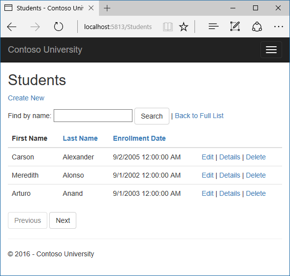
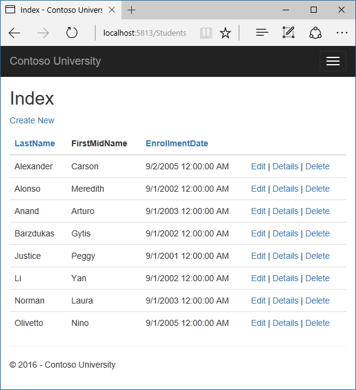
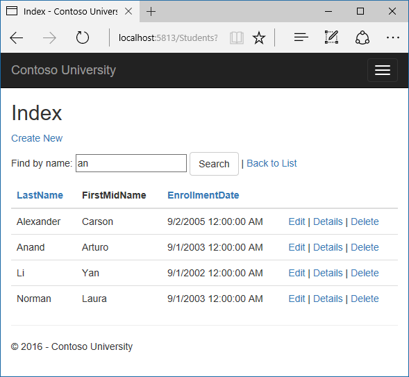

Sorting, filtering, paging, and grouping
========================================

By `Tom Dykstra`_

The Contoso University sample web application demonstrates how to create ASP.NET Core 1.0 MVC web applications using Entity Framework Core 1.0 and Visual Studio 2015. For information about the tutorial series, see :doc:`the first tutorial in the series </data/ef-mvc/intro>`.

In the previous tutorial you implemented a set of web pages for basic CRUD operations for Student entities. In this tutorial you'll add sorting, filtering, and paging functionality to the Students Index page. You'll also create a page that does simple grouping.

The following illustration shows what the page will look like when you're done. The column headings are links that the user can click to sort by that column. Clicking a column heading repeatedly toggles between ascending and descending sort order.



Add Column Sort Links to the Students Index Page
------------------------------------------------

To add sorting to the Student Index page, you'll change the Index method of the Student controller and add code to the Student Index view.

Add Sorting Functionality to the Index Method
^^^^^^^^^^^^^^^^^^^^^^^^^^^^^^^^^^^^^^^^^^^^^

In *StudentController.cs*, replace the Index method with the following code:

.. literalinclude::  intro/samples/cu/Controllers/StudentsController.cs
  :language: c#
  :linenos:
  :start-after: snippet_SortOnly
  :end-before:  #endregion
  :emphasize-lines: 8
  :dedent: 8

This code receives a sortOrder parameter from the query string in the URL. The query string value is provided by ASP.NET Core MVC as a parameter to the action method. The parameter will be a string that's either "Name" or "Date", optionally followed by an underscore and the string "desc" to specify descending order. The default sort order is ascending.

The first time the Index page is requested, there's no query string. The students are displayed in ascending order by LastName, which is the default as established by the fall-through case in the switch statement. When the user clicks a column heading hyperlink, the appropriate sortOrder value is provided in the query string.

The two ViewData elements (NameSortParm and DateSortParm) are used so that the view can configure the column heading hyperlinks with the appropriate query string values.

.. code-block:: c#

  ViewData["NameSortParm"] = String.IsNullOrEmpty(sortOrder) ? "name_desc" : "";
  ViewData["DateSortParm"] = sortOrder == "Date" ? "date_desc" : "Date";

These are ternary statements. The first one specifies that if the sortOrder parameter is null or empty, NameSortParm should be set to "name_desc"; otherwise, it should be set to an empty string. These two statements enable the view to set the column heading hyperlinks as follows:

====================  ===================  ==============
Current sort order	 Last Name Hyperlink   Date Hyperlink
====================  ===================  ==============
Last Name ascending	  descending           ascending
Last Name descending  ascending	           ascending
Date ascending        ascending            descending
Date descending       ascending	           ascending
====================  ===================  ==============

The method uses LINQ to Entities to specify the column to sort by. The code creates an IQueryable variable before the switch statement, modifies it in the switch statement, and calls the ToListAsync method after the switch statement. When you create and modify IQueryable variables, no query is sent to the database. The query is not executed until you convert the IQueryable object into a collection by calling a method such as ToListAsync. Therefore, this code results in a single query that is not executed until the ``return View`` statement.

Add Column Heading Hyperlinks to the Student Index View
^^^^^^^^^^^^^^^^^^^^^^^^^^^^^^^^^^^^^^^^^^^^^^^^^^^^^^^

Replace the code in *Views/Student/Index.cshtml*, with the following code to rearrange the column order and add column heading hyperlinks. The new column headings are highlighted.

.. literalinclude::  intro/samples/cu/Views/Students/Index2.cshtml
  :language: c#
  :linenos:
  :emphasize-lines: 16,22
  :dedent: 8

This code uses the information in ViewData properties to set up hyperlinks with the appropriate query string values.

Run the page and click the **Last Name** and **Enrollment Date** column headings to verify that sorting works.



Add a Search Box to the Students Index page
-------------------------------------------

To add filtering to the Students Index page, you'll add a text box and a submit button to the view and make corresponding changes in the Index method. The text box will let you enter a string to search for in the first name and last name fields.

Add filtering functionality to the Index method
^^^^^^^^^^^^^^^^^^^^^^^^^^^^^^^^^^^^^^^^^^^^^^^

In *StudentController.cs*, replace the Index method with the following code (the changes are highlighted).

.. literalinclude::  intro/samples/cu/Controllers/StudentsController.cs
  :language: c#
  :linenos:
  :start-after: snippet_SortFilter
  :end-before:  #endregion
  :emphasize-lines: 8
  :dedent: 8

You've added a ``searchString`` parameter to the Index method. The search string value is received from a text box that you'll add to the Index view. You've also added to the LINQ statement a where clause that selects only students whose first name or last name contains the search string. The statement that adds the where clause is executed only if there's a value to search for.

.. note:: In many cases you can call the same method either on an Entity Framework entity set or as an extension method on an in-memory collection. The results are normally the same but in some cases may be different.

  An example is variations in whether comparisons are case-insensitive. The .NET Framework implementation of the Contains method performs a case-sensitive comparison by default. But in SQL Server this is determined by the collation setting of the SQL Server instance, which defaults to case-insensitive. You could call the ToUpper method to make the test explicitly case-insensitive to ensure that results stay the same if you change the code later to use a repository which returns an IEnumerable collection instead of an IQueryable object. (When you call the Contains method on an IEnumerable collection, you get the .NET Framework implementation; when you call it on an IQueryable object, you get the database provider implementation.) However, there is a performance penalty for this solution. The code `Where(s => s.LastName.ToUpper().Contains(searchString.ToUpper())` would put a function in the WHERE clause of the TSQL SELECT statement. That would prevent the optimiser from using an index. Given that SQL is mostly installed as Case Insensitive, it's best to avoid the ToUpper code until you migrate to a case sensitive repository.

  Null handling may also be different for different database providers or when you use an IQueryable object compared to when you use an IEnumerable collection. For example, in some scenarios a Where condition such as table.Column != 0 may not return columns that have null as the value. For more information, see Incorrect handling of null variables in 'where' clause.

Add a Search Box to the Student Index View
^^^^^^^^^^^^^^^^^^^^^^^^^^^^^^^^^^^^^^^^^^

In *Views/Student/Index.cshtml*, add the highlighted code immediately before the opening table tag in order to create a caption, a text box, and a Search button.

.. literalinclude::  intro/samples/cu/Views/Students/Index3.cshtml
  :language: c#
  :linenos:
  :emphasize-lines: 5-13
  :dedent: 8

This code uses the ``<form>`` `tag helper <https://docs.asp.net/en/latest/mvc/views/tag-helpers/intro.html>`__ to add the search text box and button. By default the form tag helper submits form data with a POST, which means that parameters are passed in the HTTP message body and not in the URL as query strings. When you specify HTTP GET, the form data is passed in the URL as query strings, which enables users to bookmark the URL. The W3C guidelines recommend that you should use GET when the action does not result in an update.

Run the page, enter a search string, and click Search to verify that filtering is working.



Notice the URL contains the "an" search string, which means that if you bookmark this page, you'll get the filtered list when you use the bookmark. Adding `method="get"` to the form tag is what caused the query strings to be generated.

??## Add Paging to the Students Index Page

To add paging to the Students Index page, you'll create a PaginatedList class that uses Skip and Take statements to page through data instead of always retrieving all rows of the table. Then you'll make additional changes in the Index method and add paging links to the Index view. The following illustration shows the paging links.


In the project folder create PaginatedList.cs, and then replace the template code with the following code.

```
using System;
using System.Collections.Generic;
using System.Linq;
using System.Threading.Tasks;
using Microsoft.EntityFrameworkCore;

public class PaginatedList<T> : List<T>
{
    public int PageIndex { get; private set; }
    public int TotalPages { get; private set; }

    public PaginatedList(List<T> items, int count, int pageIndex, int pageSize)
    {
        PageIndex = pageIndex;
        TotalPages = (int)Math.Ceiling(count / (double)pageSize);

        this.AddRange(items);
    }

    public bool HasPreviousPage
    {
        get
        {
            return (PageIndex > 1);
        }
    }

    public bool HasNextPage
    {
        get
        {
            return (PageIndex < TotalPages);
        }
    }

    public static async Task<PaginatedList<T>> Create(IQueryable<T> source, int pageIndex, int pageSize)
    {
        var count = await source.CountAsync();
        var items = await source.Skip((pageIndex - 1) * pageSize).Take(pageSize).ToListAsync();
        return new PaginatedList<T>(items, count, pageIndex, pageSize);
    }
}
```

todo This code 
* takes page size, page number,IQueryable, returns a List containing only that page 
* uses skip and take added to iqueryable
* create method for async, can't make a constructor async

## Add Paging Functionality to the Index Method

In Controllers\StudentController.cs, replace the Index method with the following code:

```
[Route("[controller]/Page/{page:int?}")]
public async Task<IActionResult> Index(
    string sortOrder, 
    string currentFilter, 
    string searchString, 
    int? page)
{
    ViewData["CurrentSort"] = sortOrder;
    ViewData["NameSortParm"] = String.IsNullOrEmpty(sortOrder) ? "name_desc" : "";
    ViewData["DateSortParm"] = sortOrder == "Date" ? "date_desc" : "Date";

    if (searchString != null)
    {
        page = 1;
    }
    else
    {
        searchString = currentFilter;
    }

    ViewData["CurrentFilter"] = searchString;

    var students = from s in _context.Students
                   select s;
    if (!String.IsNullOrEmpty(searchString))
    {
        students = students.Where(s => s.LastName.Contains(searchString)
                               || s.FirstMidName.Contains(searchString));
    }
    switch (sortOrder)
    {
        case "name_desc":
            students = students.OrderByDescending(s => s.LastName);
            break;
        case "Date":
            students = students.OrderBy(s => s.EnrollmentDate);
            break;
        case "date_desc":
            students = students.OrderByDescending(s => s.EnrollmentDate);
            break;
        default:
            students = students.OrderBy(s => s.LastName);
            break;
    }

    int pageSize = 3;
    return View(await PaginatedList<Student>.Create(students, page ?? 1, pageSize));
}
```

This code adds a page parameter, a current sort order parameter, and a current filter parameter to the method signature:

```
public ActionResult Index(string sortOrder, string currentFilter, string searchString, int? page)
```

The first time the page is displayed, or if the user hasn't clicked a paging or sorting link, all the parameters will be null.  If a paging link is clicked, the page variable will contain the page number to display.

A ViewData property provides the view with the current sort order, because this must be included in the paging links in order to keep the sort order the same while paging:

```
ViewData["CurrentSort"] = sortOrder;
```

Another property, ViewData["CurrentFilter"], provides the view with the current filter string. This value must be included in the paging links in order to maintain the filter settings during paging, and it must be restored to the text box when the page is redisplayed. If the search string is changed during paging, the page has to be reset to 1, because the new filter can result in different data to display. The search string is changed when a value is entered in the text box and the submit button is pressed. In that case, the searchString parameter is not null.

```
if (searchString != null)
{
    page = 1;
}
else
{
    searchString = currentFilter;
}
```

At the end of the method, the PaginatedList.Create method converts the student query to a single page of students in a collection type that supports paging. That single page of students is then passed to the view

```
return View(await PaginatedList<Student>.Create(students, page ?? 1, pageSize));
```

The PaginatedList.Create method takes a page number. The two question marks represent the null-coalescing operator. The null-coalescing operator defines a default value for a nullable type; the expression (page ?? 1) means return the value of page if it has a value, or return 1 if page is null.

## Add Paging Links to the Student Index View

In Views\Student\Index.cshtml, replace the existing code with the following code. the changes are highlighted.

```
@model PaginatedList<ContosoUniversity.Models.Student>

@{
    ViewData["Title"] = "Students";
}

<h2>Students</h2>

<p>
    <a asp-action="Create">Create New</a>
</p>

<form asp-action="Index" method="get">
    <div class="form-actions no-color">
        <p>
            Find by name: <input type="text" name="SearchString" value="@ViewData["CurrentFilter"]" />
            <input type="submit" value="Search" class="btn btn-default" /> |
            <a asp-action="Index">Back to Full List</a>
        </p>
    </div>
</form>

<table class="table">
    <thead>
        <tr>
            <th>
                <a asp-action="Index" asp-route-sortOrder="@ViewData["DateSortParm"]" asp-route-currentFilter ="@ViewData["CurrentFilter"]">Enrollment Date</a>
            </th>
            <th>
                First Name
            </th>
            <th>
                <a asp-action="Index" asp-route-sortOrder="@ViewData["NameSortParm"]" asp-route-currentFilter ="@ViewData["CurrentFilter"]">Last Name</a>
            </th>
            <th></th>
        </tr>
    </thead>
    <tbody>
@foreach (var item in Model) {
        <tr>
            <td>
                @Html.DisplayFor(modelItem => item.EnrollmentDate)
            </td>
            <td>
                @Html.DisplayFor(modelItem => item.FirstMidName)
            </td>
            <td>
                @Html.DisplayFor(modelItem => item.LastName)
            </td>
            <td>
                <a asp-action="Edit" asp-route-id="@item.ID">Edit</a> |
                <a asp-action="Details" asp-route-id="@item.ID">Details</a> |
                <a asp-action="Delete" asp-route-id="@item.ID">Delete</a>
            </td>
        </tr>
}
    </tbody>
</table>

@if (Model.HasPreviousPage)
{
    <a asp-action="Index" asp-route-sortOrder="@ViewData["CurrentSort"]" asp-route-page="@(Model.PageIndex - 1)" asp-route-currentFilter="@ViewData["CurrentFilter"]"><<<</a>
}

@if (Model.HasNextPage)
{
    <a asp-action="Index" asp-route-sortOrder="@ViewData["CurrentSort"]" asp-route-page="@(Model.PageIndex + 1)" asp-route-currentFilter="@ViewData["CurrentFilter"]">>>></a>
}
```

The @model statement at the top of the page specifies that the view now gets a PaginatedList object instead of a List object.

The text box is initialized with the current search string so when you click a new page you can see the current search string.

```
Find by name: <input type="text" name="SearchString" value="@ViewData["CurrentFilter"]" />
```

The column header links use the query string to pass the current search string to the controller so that the user can sort within filter results:

```
<a asp-action="Index" asp-route-sortOrder="@ViewData["DateSortParm"]" asp-route-currentFilter ="@ViewData["CurrentFilter"]">Enrollment Date</a>
```

The paging links are displayed by tag helpers:

```
@{
    var prevDisabled = !Model.HasPreviousPage ? "disabled" : "";
    var nextDisabled = !Model.HasNextPage ? "disabled" : "";
}

<a asp-action="Index" 
   asp-route-sortOrder="@ViewData["CurrentSort"]" 
   asp-route-page="@(Model.PageIndex - 1)" 
   asp-route-currentFilter="@ViewData["CurrentFilter"]" 
   class="btn btn-default @prevDisabled btn">
    Previous
</a>
<a asp-action="Index" 
   asp-route-sortOrder="@ViewData["CurrentSort"]" 
   asp-route-page="@(Model.PageIndex + 1)" 
   asp-route-currentFilter="@ViewData["CurrentFilter"]" 
   class="btn btn-default @nextDisabled btn">
    Next
</a>

```

Run the page.


Click the paging links in different sort orders to make sure paging works. Then enter a search string and try paging again to verify that paging also works correctly with sorting and filtering.

## Create an About Page That Shows Student Statistics

For the Contoso University website's About page, you'll display how many students have enrolled for each enrollment date. This requires grouping and simple calculations on the groups. To accomplish this, you'll do the following:

* Create a view model class for the data that you need to pass to the view.
* Modify the About method in the Home controller.
* Modify the About view.

### Create the View Model

Create a SchoolViewModels folder in the Models folder. In that folder, add a class file EnrollmentDateGroup.cs and replace the template code with the following code:

```
using System;
using System.ComponentModel.DataAnnotations;

namespace ContosoUniversity.Models.SchoolViewModels
{
    public class EnrollmentDateGroup
    {
        [DataType(DataType.Date)]
        public DateTime? EnrollmentDate { get; set; }

        public int StudentCount { get; set; }
    }
}
```

### Modify the Home Controller

In HomeController.cs, add the following using statements at the top of the file:

```
using Microsoft.EntityFrameworkCore;
using ContosoUniversity.Data;
using ContosoUniversity.Models.SchoolViewModels;
```

Add a class variable for the database context immediately after the opening curly brace for the class, and get an instance of the context from ASP.NET Core DI:

```
private readonly SchoolContext _context;

public HomeController(SchoolContext context)
{
    _context = context;
}
```

Replace the About method with the following code:

```
public async Task<ActionResult> About()
{
    IQueryable<EnrollmentDateGroup> data = 
        from student in _context.Students
        group student by student.EnrollmentDate into dateGroup
        select new EnrollmentDateGroup()
        {
            EnrollmentDate = dateGroup.Key,
            StudentCount = dateGroup.Count()
        };
    return View(await data.ToListAsync());
}
```

The LINQ statement groups the student entities by enrollment date, calculates the number of entities in each group, and stores the results in a collection of EnrollmentDateGroup view model objects.

### Modify the About View

Replace the code in the Views\Home\About.cshtml file with the following code:

```
@model IEnumerable<ContosoUniversity.Models.SchoolViewModels.EnrollmentDateGroup>

@{
    ViewBag.Title = "Student Body Statistics";
}

<h2>Student Body Statistics</h2>

<table>
    <tr>
        <th>
            Enrollment Date
        </th>
        <th>
            Students
        </th>
    </tr>

    @foreach (var item in Model)
    {
        <tr>
            <td>
                @Html.DisplayFor(modelItem => item.EnrollmentDate)
            </td>
            <td>
                @item.StudentCount
            </td>
        </tr>
    }
</table>
```

Run the app and click the About link. The count of students for each enrollment date is displayed in a table.

todo warn about performance implications whether grouping is done in SQL server or client, typically on client in 1.0


## Summary

In this tutorial you've seen how to perform sorting, filtering, paging, and grouping. In the next tutorial you'll begin looking at more advanced topics by expanding the data model.
